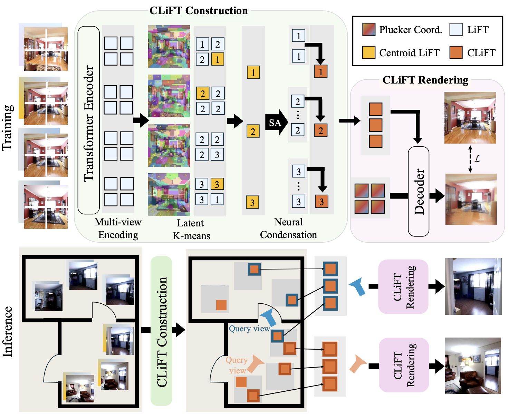

<div align="center">
<h2 align="center">CLiFT: Compressive Light-Field Tokens for Compute-Efficient and Adaptive Neural Rendering</h2>

[Zhengqing Wang<sup>1</sup>](https://eric-zqwang.github.io/) , [Yuefan Wu<sup>1</sup>](https://ivenwu.com/) , [Jiacheng Chen<sup>1</sup>](https://jcchen.me) , [Fuyang Zhang<sup>1</sup>](https://zhangfuyang.github.io/) , [Yasutaka Furukawa<sup>1,2</sup>](https://www2.cs.sfu.ca/~furukawa/)

<sup>1</sup> Simon Fraser University <sup>2</sup> Wayve

([arXiv](https://arxiv.org/abs/2507.08776), [Project page](https://clift-nvs.github.io/))
</div>

https://github.com/user-attachments/assets/fc3539df-28fc-4529-b6e6-9a231f2bd87f

## Checklists
- [x] Release the training and inference on RE10K
- [ ] Add more detailed docs
- [ ] Release the training and inference on DL3DV

## Table of Content
- [Introduction](#introduction)
- [Installation](#installation)
- [Data preparation](#data-preparation)
- [Getting started](#getting-started)
- [Citation](#citation)
- [License](#license)


## Introduction

This paper proposes a neural rendering approach that represents a scene as "compressed light-field tokens (CLiFTs)", retaining rich appearance and geometric information of a scene.

<div align="center">

</div>

 CLiFT enables compute-efficient rendering by compressed tokens, while being capable of changing the number of tokens to represent a scene or render a novel view with one trained network. \
 Concretely, given a set of images, 1) multi-view encoder tokenizes the images with the camera poses, 2) latent-space K-means selects a reduced set of rays as cluster centroids using the tokens, 3) the multi-view "condenser" compresses the information of all the tokens into the centroid tokens to construct CLiFTs. \
 At test time, given a target view and a compute budget (i.e., the number of CLiFTs), the system collects the specified number of nearby tokens and synthesizes a novel view using a compute-adaptive renderer.

## Installation

Please refer to the [installation guide](docs/installation.md) to set up the environment.


## Data preparation

Please refer to the [data preparation guide](docs/data_preparation.md) to download and prepare for the RealEstate10K dataset.


## Getting started

Please follow the [test guide](docs/test.md) for model inference, evaluation, and visualization.

Please follow the [training guide](docs/training.md) for details about the training pipeline.

## Citation

If you find CLiFT useful in your research or applications, please consider citing:

```
@article{Wang2025CLiFT,
  author    = {Wang, Zhengqing and Wu, Yuefan and Chen, Jiacheng and Zhang, Fuyang and Furukawa, Yasutaka},
  title     = {CLiFT: Compressive Light-Field Tokens for Compute Efficient and Adaptive Neural Rendering},
  journal   = {arXiv preprint arXiv:2507.08776},
  year      = {2025},
}
```

Our method is deeply inspired by [LVSM](https://github.com/haian-jin/LVSM) and [DepthSplat](https://github.com/cvg/depthsplat), and benefited from their open-source code. Please consider reading these papers if interested in relevant topics.


## License
This project is licensed under GPL, see the [license file](LICENSE) for details.